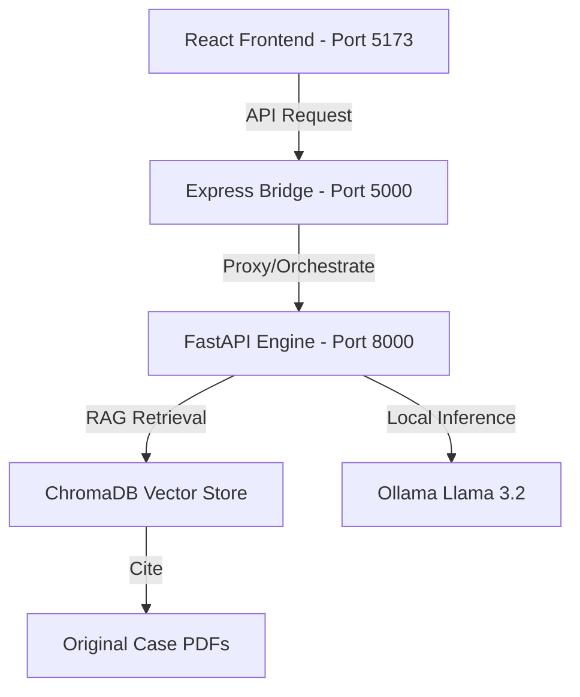

# LexAgent System Architecture

LexAgent is built using a decoupled, 3-tier architecture to ensure scalability, security, and fast local performance.

## 🏗 High-Level Diagram

## 🧩 Components

### 1. Presentation Layer (Frontend)
- **Framework**: React 18+ with Vite.
- **Styling**: Tailwind CSS v4 for a cutting-edge design system.
- **State Management**: React Hooks and Context for managing the agentic pipeline states.
- **Visuals**: Framer Motion for premium micro-animations.

### 2. Orchestration Layer (Backend)
- **Framework**: Node.js / Express.
- **Purpose**: Acts as a security and routing bridge between the public frontend and the internal AI engine. It handles authentication and log management.

### 3. Intelligence Layer (AI Engine)
- **Framework**: FastAPI (Python).
- **Vector Search**: ChromaDB using Sentence-Transformers for semantic understanding of legal text.
- **LLM Reasoning**: LangChain-wrapped Ollama.
- **Pipeline**:
    1. **Preprocessing**: Cleans the user query.
    2. **Retrieval**: Performs a semantic search for the top 3-5 legal precedents.
    3. **Synthesis**: Prompts the LLM with the retrieved context to generate a structured memo.
    4. **Verification**: Cross-references citations with the original metadata.

## 🗃 Data Flow
1. User enters query in the **Live Workspace**.
2. Frontend sends a `POST` request to the **Express Bridge**.
3. Express Bridge forwards the query to the **FastAPI Intelligence Layer**.
4. FastAPI queries **ChromaDB** for similar case law.
5. **Llama 3.2** synthesizes the final memo using the retrieved snippets.
6. The memo is streamed back to the frontend for display and PDF export.
