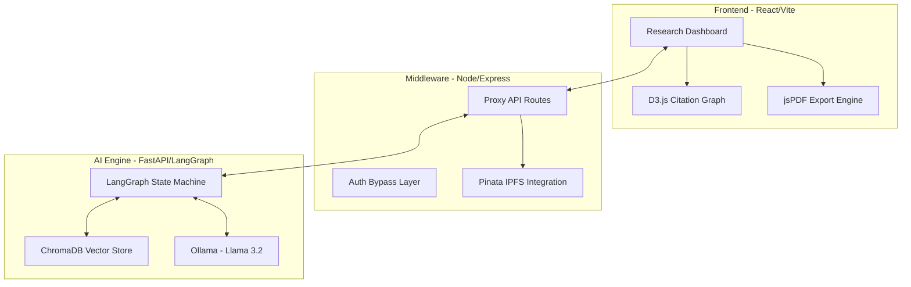

# LexAgent — System Architecture (v2.0)

LexAgent is an autonomous legal research platform built with a decentralized, multi-agent architecture. This document outlines the technical design, data flow, and the 5-agent reasoning engine.

---

## 📑 Table of Contents
1. [🏢 High-Level Architecture](#-high-level-architecture)
2. [🤖 The 5-Agent Reasoning Engine (LangGraph)](#-the-5-agent-reasoning-engine-langgraph)
3. [💻 Tier 1: Frontend (The Command Center)](#-tier-1-frontend-the-command-center)
4. [🌉 Tier 2: Backend (The Bridge)](#-tier-2-backend-the-bridge)
5. [🧠 Tier 3: AI Engine (The Brain)](#-tier-3-ai-engine-the-brain)
6. [📂 Data Workflow & RAG](#-data-workflow--rag)
7. [🔐 Decentralized Vault (IPFS)](#-decentralized-vault-ipfs)

---

## 🏢 High-Level Architecture

LexAgent uses a decoupled 3-tier system to separate user interaction from heavy AI computation and decentralized storage.

---

## 🤖 The 5-Agent Reasoning Engine (LangGraph)

The core of LexAgent is a multi-agent system implemented using **LangGraph**. Instead of a single prompt, a shared **AgentState** object is passed through five specialized agents:

| Agent | Responsibility | Output |
| :--- | :--- | :--- |
| **1. Parser** | Extracts court names, years, and legal intent. | Structured JSON filters. |
| **2. Researcher** | Performs hybrid search in the local Vector Store. | Raw case chunks. |
| **3. Summarizer** | Distills legal logic (Ratio Decidendi) from text. | Concise legal holdings. |
| **4. Critic** | Audits for relevance and finds dissenting views. | Supportive vs. Dissenting flags. |
| **5. Synthesizer** | Constructs the final memorandum. | Court-ready markdown memo. |

---

## 💻 Tier 1: Frontend (The Command Center)
*   **Framework**: React 18 with Vite.
*   **Styling**: Vanilla CSS + Tailwind (Executive Ivory Light Theme).
*   **Animations**: `framer-motion` for sliding menus and state transitions.
*   **Visuals**: `lucide-react` for iconography.
*   **Advanced Features**:
    *   **D3.js**: Interactive force-directed graph for citation networks.
    *   **jsPDF**: Client-side generation of professional legal memos.
    *   **React-Markdown**: Real-time rendering of AI-generated content.

---

## 🌉 Tier 2: Backend (The Bridge)
*   **Runtime**: Node.js / Express.
*   **Function**: Acts as the orchestrator between the UI and the decentralized vault.
*   **Decentralization**: Uses **Pinata** to pin legal files to **IPFS**, ensuring case metadata is immutable and decentralized.
*   **Security**: Centralized `.env` management for API keys.

---

## 🧠 Tier 3: AI Engine (The Brain)
*   **Framework**: FastAPI (Python 3.12+).
*   **Orchestration**: **LangGraph** (State-based multi-agent execution).
*   **Vector Database**: **ChromaDB** (Persistent local storage of 400+ case embeddings).
*   **Local Inference**: **Ollama** running the **Llama 3.2** model for data privacy and speed.

---

## 📂 Data Workflow & RAG
1.  **ETL**: 400+ Supreme Court PDFs are extracted into a master JSON.
2.  **Embedding**: Text is chunked (2000 chars) and embedded using `sentence-transformers`.
3.  **Retrieval**: The **Researcher Agent** pulls the top 10 most relevant chunks based on cosine similarity.
4.  **Augmentation**: The **Synthesizer** uses these chunks to ground the LLM's response, preventing hallucinations.

---

## 🔐 Decentralized Vault (IPFS)
LexAgent uses a "Vault Node" strategy. When a user uploads a new case:
1.  The file is uploaded to **IPFS**.
2.  The **CID** (Content Identifier) is returned.
3.  Metadata (Case No, Status) is pinned to IPFS, ensuring it can never be deleted or altered by a central authority.
