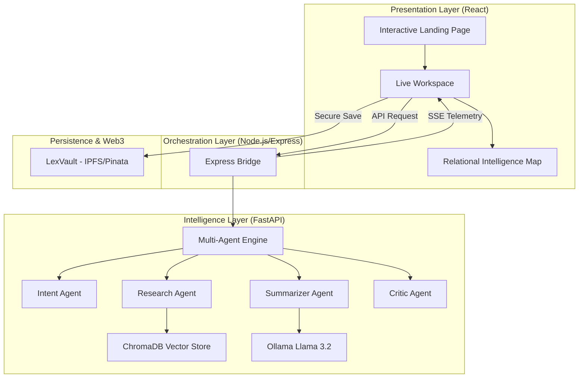

# LexAgent System Architecture

LexAgent is an advanced, multi-agentic legal research system built on a decoupled, 3-tier architecture. It leverages a custom-built Multi-Agent Orchestration Engine to transform raw legal datasets into synthesized, court-grade intelligence.

## 🏗 High-Level Architecture

## 🧩 Core Components

### 1. Presentation Layer (Frontend)
- **Framework**: React 18+ with Vite.
- **Motion Engine**: **Framer Motion** for premium, interactive animations (specifically in the Junior Clerk section and Live Workspace).
- **Visualization**: Custom **Relational Intelligence Map** (SVG/D3-based) showing Selection Logic and Lateral Citations.
- **State Management**: Real-time telemetry via **Server-Sent Events (SSE)** to visualize the "Chain of Thought" between agents.

### 2. Orchestration Layer (Backend Bridge)
- **Framework**: Node.js / Express.
- **Role**: Acts as a high-performance proxy and event dispatcher. It manages the lifecycle of the research session and provides the SSE stream that powers the frontend "Agent Pulse."

### 3. Intelligence Layer (The Multi-Agent Engine)
Built with **FastAPI** and **LangChain**, this layer executes a proprietary 4-stage agentic workflow:
1. **Intent Agent**: Deconstructs natural language into strict legal metadata (Acts, Sections, Years).
2. **Research Agent**: Performs sub-second semantic retrieval from a vector vault of **37,000+ Supreme Court precedents** (1950-2025).
3. **Summarizer Agent**: Analyzes retrieved full-text documents to extract the *Ratio Decidendi* and verbatim holdings.
4. **Critic Agent**: The "Quality Gate." It cross-references the summary against the original query, assigns a **Verdict** (Approved/Dissenting), and calculates a confidence score.

### 4. Web3 Persistence (LexVault)
- **Technology**: IPFS with Pinata Pinning.
- **Purpose**: Allows users to save their research memos and verified precedents on a decentralized network, ensuring they are tamper-proof and permanent.

## 🗃 Data Flow & Telemetry
1. **Query Initiation**: The user submits a query via the Research Dashboard.
2. **Agentic Pulse**: The FastAPI engine spawns the agentic pipeline. Each agent emits "Status Events" as it works.
3. **Real-time Stream**: These events are piped through the Express Bridge via SSE to the Frontend, where the user sees the **Chain of Thought** in real-time.
4. **Synthesis**: Once the Critic Agent approves the findings, a **Partner-Ready Memo** is generated.
5. **Decentralized Storage**: The user can choose to push the final memo to **LexVault**, receiving a unique IPFS CID for verification.

## 🛠 Tech Stack
- **AI/LLM**: Llama 3.2 (Local via Ollama).
- **Vector DB**: ChromaDB.
- **Embeddings**: Sentence-Transformers (all-MiniLM-L6-v2).
- **Frontend**: React, Tailwind CSS v4, Framer Motion, Lucide Icons.
- **Backend**: Node.js, Express, FastAPI, LangChain.
- **Storage**: IPFS, Pinata.
